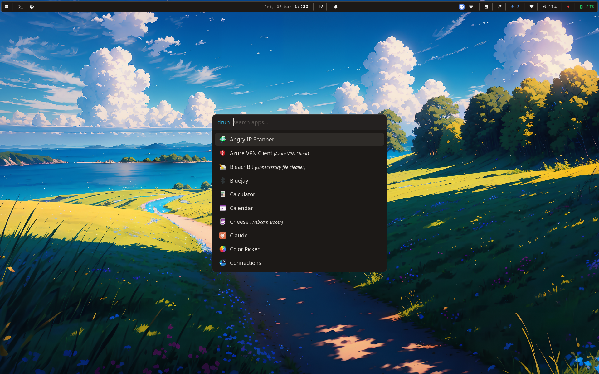

# Dotfiles for my theme of hyprland (inspired by tailwind)



> [!TIP]
> I recommend symbolic linking the folders to .config (each folder separately)

> [!NOTE]
> I made this on Nobara 42 Gnome so there may be some Fedora/Nobara specific commands.

## Dependencies

* `hyprland`
* `kitty`
* `wofi`
* `wlogout`
* `nautilus`
* `clipse`
* `cliphist`
* `hyprpaper`
* `hyprpicker`
* `hyprlock`
* `hypridle`
* `gtklock`
* `swaync`
* `grim`
* `slurp`
* `swappy`
* `tesseract`
* `wl-clipboard`
* `swayosd`
* `neovim`
* `waybar`
* `firefox`
* `brightnessctl`
* `playerctl`
* `pavucontrol`
* `polkit-gnome`
* `network-manager-applet`
* `gnome-calendar`
* `gnome-keyring`
* `powerprofilesctl`
* `io.github.ebonjaeger.bluejay`

## Install Dependancies (Nobara 42)

### External repositories

```bash
sudo dnf copr enable lionheartp/Hyprland                    # hyprland
sudo dnf copr enable azandure/clipse                        # clipboard
sudo dnf copr enable erikreider/SwayNotificationCenter      # swaync
sudo dnf copr enable washkinazy/wayland-wm-extras           # swayosd + gtklock
```

#### Optional integration of Kitty to Nautilus

```bash
sudo dnf copr enable monkeygold/nautilus-open-any-terminal
sudo dnf install nautilus-open-any-terminal
```

### Install all dependancies

```bash
sudo dnf install hyprland kitty wofi wlogout nautilus clipse cliphist hyprpaper hyprpicker hyprlock hypridle swaync grim slurp swappy tesseract wl-clipboard swayosd neovim waybar firefox brightnessctl playerctl pavucontrol polkit-gnome network-manager-applet gnome-calendar gnome-keyring powerprofilesctl gtklock gtklock-meta gtklock-playerctl-module gtklock-userinfo-module
```
> **Note:** For Bluetooth app Bluejay, install with:
> ```bash
> flatpak install flathub io.github.ebonjaeger.bluejay
> ```

## Setup

### Quick Setup (Recommended)

For a fresh installation, use the automated setup script:

```bash
cd /path/to/dotfiles
chmod +x setup.sh
./setup.sh
```

This script will:
- Check for missing dependencies
- Offer to install them (on Fedora/Nobara)
- Create symlinks for all config directories
- Set up script permissions
- Configure initial system settings (GTK theme, SwayOSD)

### Manual Setup

If you prefer to set up manually:

#### Wallpapers

Set your own pictures directory in `scripts/wallpaper.sh`

```bash
chmod +x scripts/wallpaper.sh
```

and add all pictures to hyprpaper to preload otherwise it will not work

```bash
nvim hypr/hyprpaper.conf
```

### Restart script

This script is for easily restarting startup services

```bash
chmod +x scripts/restart.sh
```

If you modified any of the dependencies you should modify the processes here also:

```bash
nvim scripts/restart.sh
```

### Idle timeout

Set your own custom values in `hypr/hypridle.conf`

```bash
nvim hypr/hypridle.conf
```

### Keybinds

Set your own preferred keybinds at `hypr/hyprland.conf`

```bash
nvim hypr/hyprland.conf
```

### OSD

You will need to run this command for osd to run

```bash
sudo systemctl start --now swayosd-libinput-backend.service
sudo systemctl enable --now swayosd-libinput-backend.service
```

### Remote Access (wayvnc)

wayvnc is an optional VNC server for remote desktop access from other devices on your network.

**Start/stop:** `Super+Shift+V` — toggles wayvnc on/off and shows a notification with the IP:port to connect to.

**Connect:** Use any VNC viewer (e.g. TigerVNC) and connect to `<local-ip>:5900`.

```bash
vncviewer <local-ip>:5900
```

**Security:** The default config binds to `0.0.0.0` with no authentication — suitable for a trusted LAN. For remote access outside your LAN, use [Tailscale](https://tailscale.com) to keep it private.

To add password auth, edit `wayvnc/config`:

```ini
enable_auth=true
username=ghost
password=yourpassword
```

**Note:** wayvnc is not started automatically. Use `Super+Shift+V` to start it when needed. Running `Super+B` (restart services) will stop wayvnc if it was active.
