# Dotfiles for my theme of hyprland (inspired by tailwind)

[](https://github.com/Gren-95/hyprland-dots/actions/workflows/lint.yml)

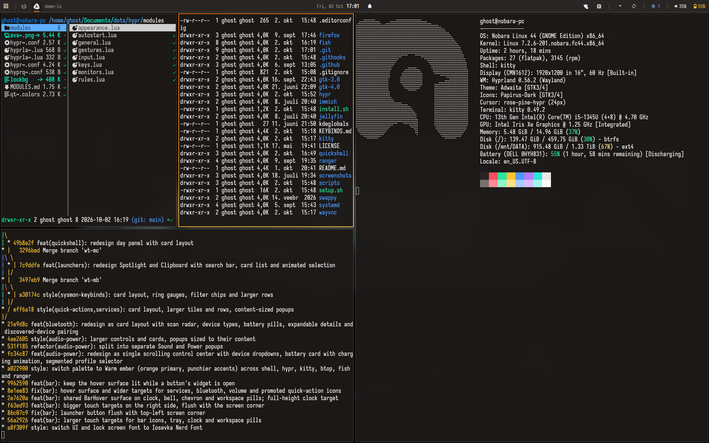

## Gallery

The top bar (always visible):

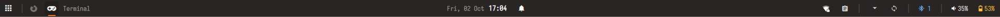

Modals reachable from keybindings or the bar:

<table>
  <tr>
    <td align="center" width="33%" valign="top">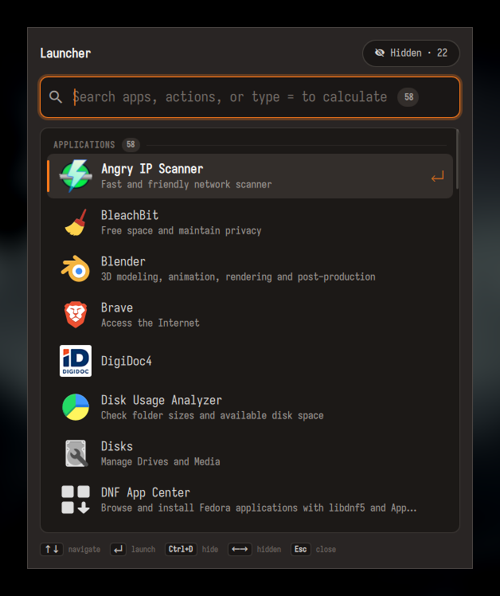<br><strong>Launcher</strong><br>apps, actions, calculator<br><kbd>Super</kbd>+<kbd>R</kbd></td>
    <td align="center" width="33%" valign="top">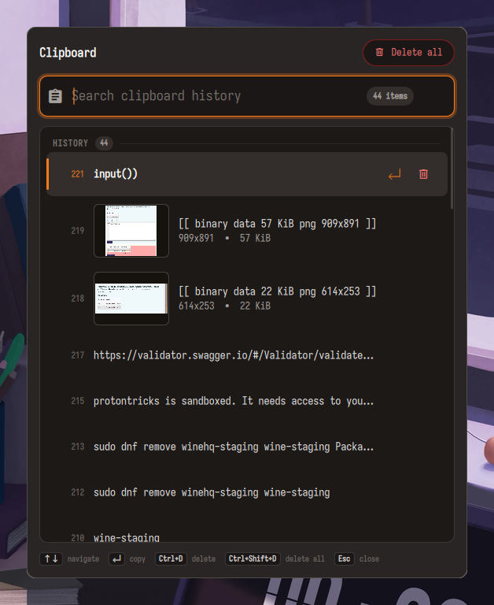<br><strong>Clipboard</strong><br>history with thumbnails<br><kbd>Super</kbd>+<kbd>V</kbd></td>
    <td align="center" width="33%" valign="top">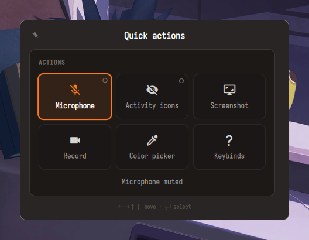<br><strong>Quick Actions</strong><br>toggles and one-shots<br><kbd>Super</kbd>+<kbd>A</kbd></td>
  </tr>
  <tr>
    <td align="center" width="33%" valign="top">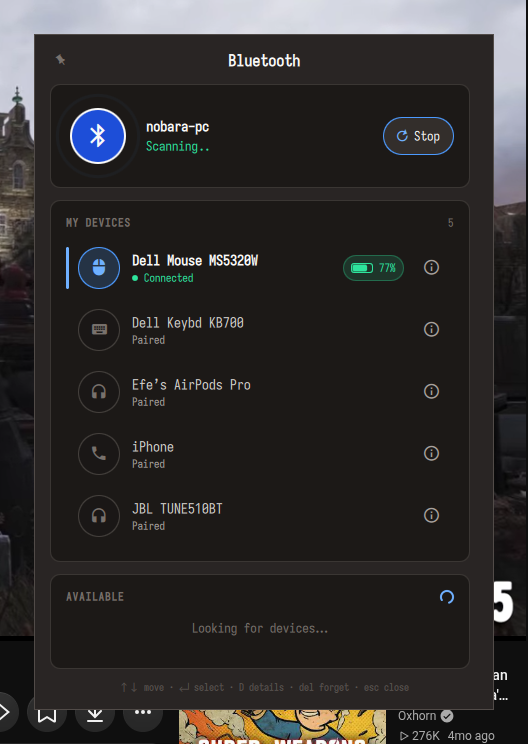<br><strong>Bluetooth</strong><br>paired devices, scan, pairing<br><kbd>Super</kbd>+<kbd>Shift</kbd>+<kbd>B</kbd></td>
    <td align="center" width="33%" valign="top">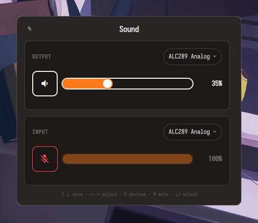<br><strong>Sound</strong><br>output, input, device dropdowns<br><kbd>Super</kbd>+<kbd>S</kbd></td>
    <td align="center" width="33%" valign="top">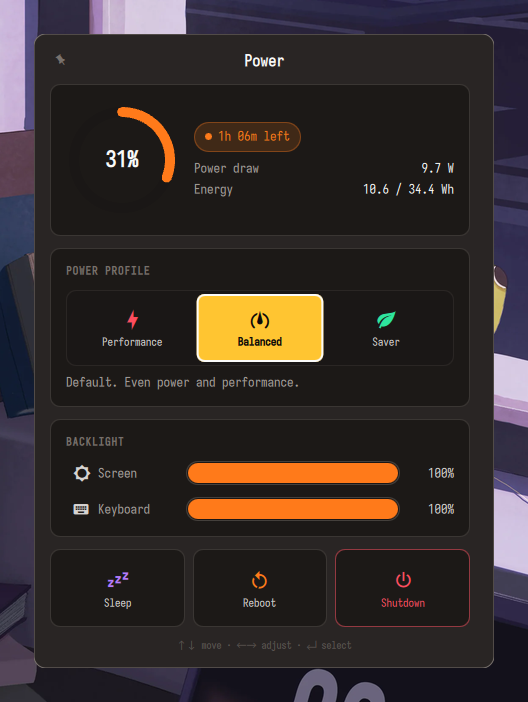<br><strong>Power</strong><br>battery, profile, backlight, session<br><kbd>Super</kbd>+<kbd>Shift</kbd>+<kbd>E</kbd></td>
  </tr>
  <tr>
    <td align="center" width="33%" valign="top">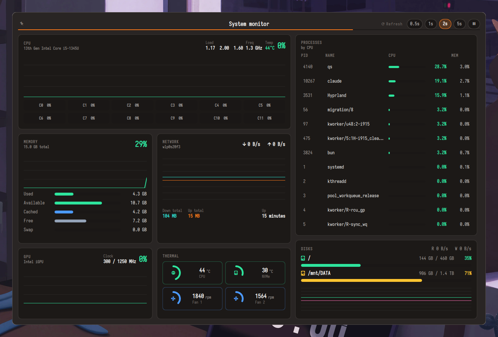<br><strong>System Monitor</strong><br>btop-style graphs: CPU, GPU, memory, network, disks, processes<br><kbd>Super</kbd>+<kbd>M</kbd></td>
    <td align="center" width="33%" valign="top">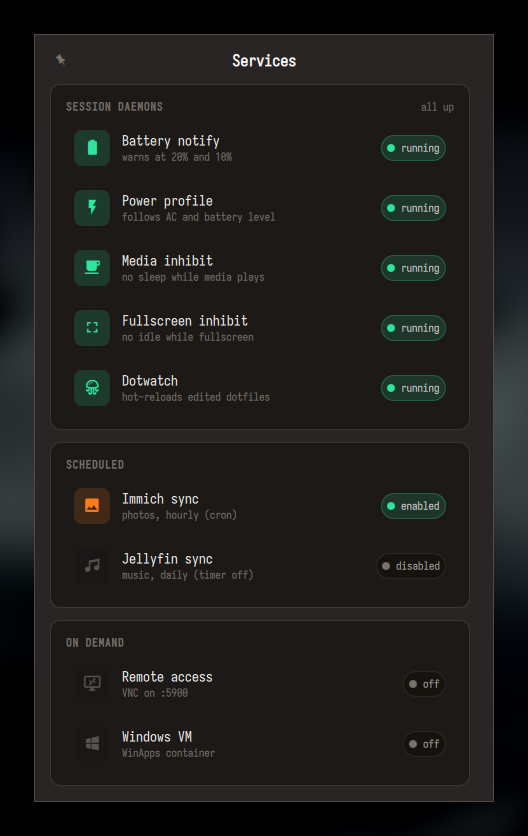<br><strong>Services</strong><br>background daemons and sync<br>bar button</td>
    <td align="center" width="33%" valign="top">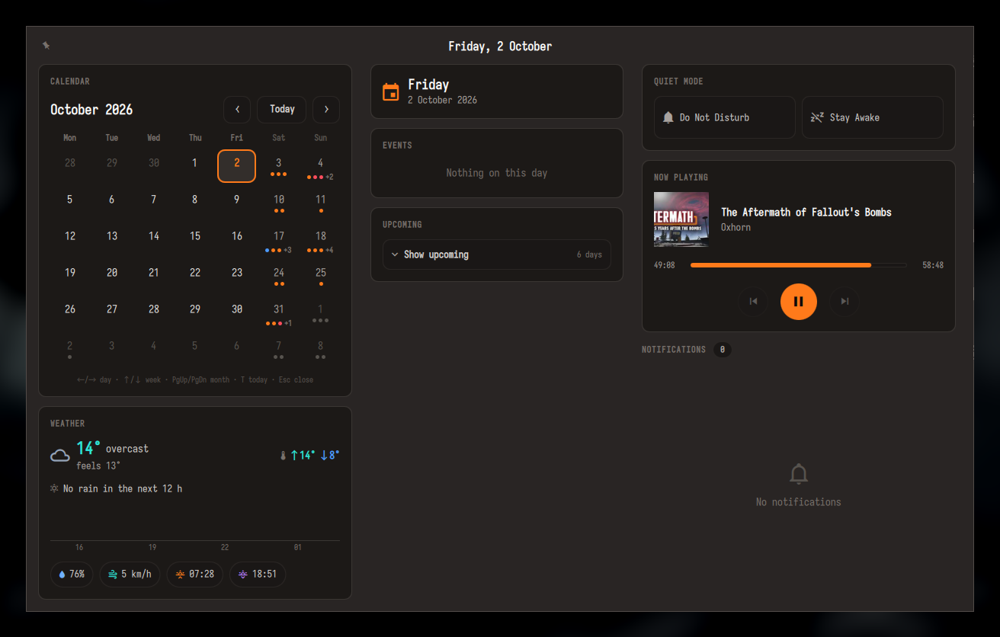<br><strong>Day Panel</strong><br>calendar, weather, media, notifications<br><kbd>Super</kbd>+<kbd>N</kbd> / <kbd>Super</kbd>+<kbd>D</kbd></td>
  </tr>
  <tr>
    <td align="center" width="33%" valign="top">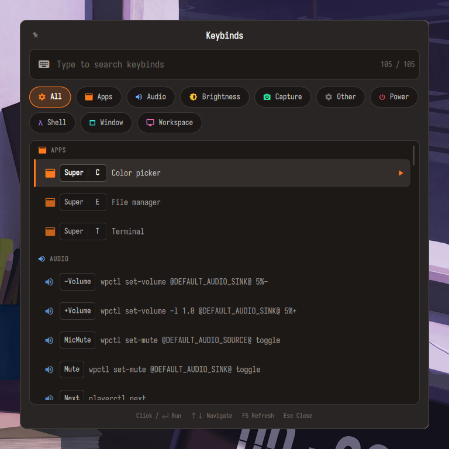<br><strong>Keybinds Viewer</strong><br>search, filter, click to run<br><kbd>Super</kbd>+<kbd>F1</kbd></td>
    <td align="center" width="33%" valign="top">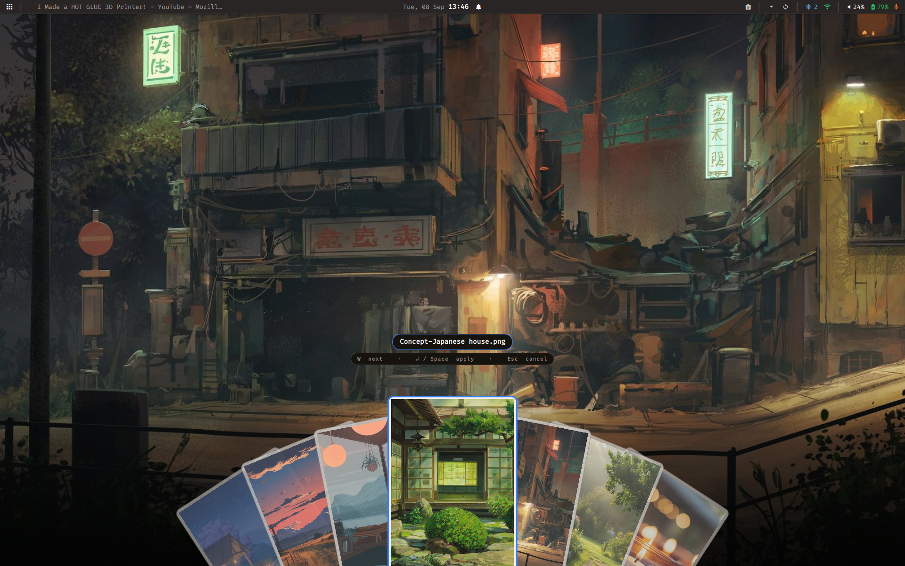<br><strong>Wallpaper Deck</strong><br>hold <kbd>Super</kbd>, tap <kbd>W</kbd> to deal, release to apply</td>
    <td align="center" width="33%" valign="top">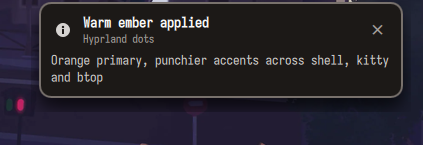<br><strong>Notification Toast</strong><br>auto-shown on incoming notification</td>
  </tr>
</table>

> [!TIP]
> Use `setup.sh` for automated installation, or `dotfiles-manager.sh` for managing symlinks.

> [!NOTE]
> Built on Nobara 44 with Hyprland 0.56.2 and Quickshell 0.3.1. The Hyprland
> config is Lua, which needs Hyprland 0.55+. Some commands are Fedora/Nobara
> specific.

## Documentation

- [`ARCHITECTURE.md`](ARCHITECTURE.md) — how Hyprland, Quickshell, scripts, and cron fit together
- [`KEYBINDS.md`](KEYBINDS.md) — flat keybind reference (live viewer: `Super+F1`)
- [`docs/INSTALL.md`](docs/INSTALL.md) — dependencies and manual setup
- [`docs/CONFIGURATION.md`](docs/CONFIGURATION.md) — wallpapers, idle timeout, default apps, OSD, screen recording, wayvnc
- [`docs/DAEMONS.md`](docs/DAEMONS.md) — background daemons and dotwatch hot-reload
- [`docs/SERVICES.md`](docs/SERVICES.md) — scheduled jobs, Immich, Jellyfin, WinApps
- [`docs/DEVELOPMENT.md`](docs/DEVELOPMENT.md) — lint checks and the pre-commit hook
- [`quickshell/DESIGN.md`](quickshell/DESIGN.md) — QML widget conventions and recipes
- [`scripts/README.md`](scripts/README.md) — per-script breakdown (what runs when)
- [`hypr/MODULES.md`](hypr/MODULES.md) — what each `hypr/modules/*.lua` owns

## Setup

### One-command Install (Recommended)

```bash
bash <(curl -fsSL https://raw.githubusercontent.com/Gren-95/hyprland-dots/main/install.sh)
```

This will clone the repo to `~/dotfiles` and run the setup script automatically.

Dependencies, manual setup and the Firefox profile step are in [`docs/INSTALL.md`](docs/INSTALL.md).

After install, see [`docs/CONFIGURATION.md`](docs/CONFIGURATION.md) for wallpapers and other settings, and `Super+F1` for keybinds.

## Dotfiles Manager

```bash
./dotfiles-manager.sh status          # Check all symlink states
./dotfiles-manager.sh backup          # Create symlinks (backs up existing dirs)
./dotfiles-manager.sh backup --dry-run  # Preview without making changes
./dotfiles-manager.sh fix             # Fix broken or inconsistent symlinks
./dotfiles-manager.sh undo            # Restore backups and remove symlinks
```
